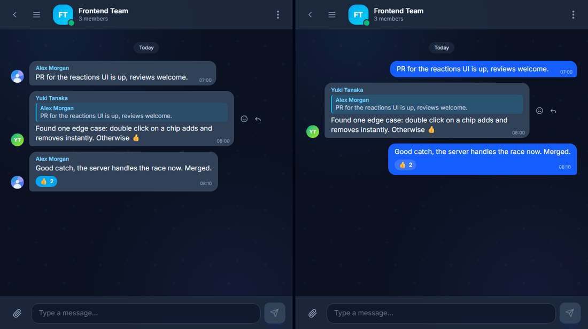
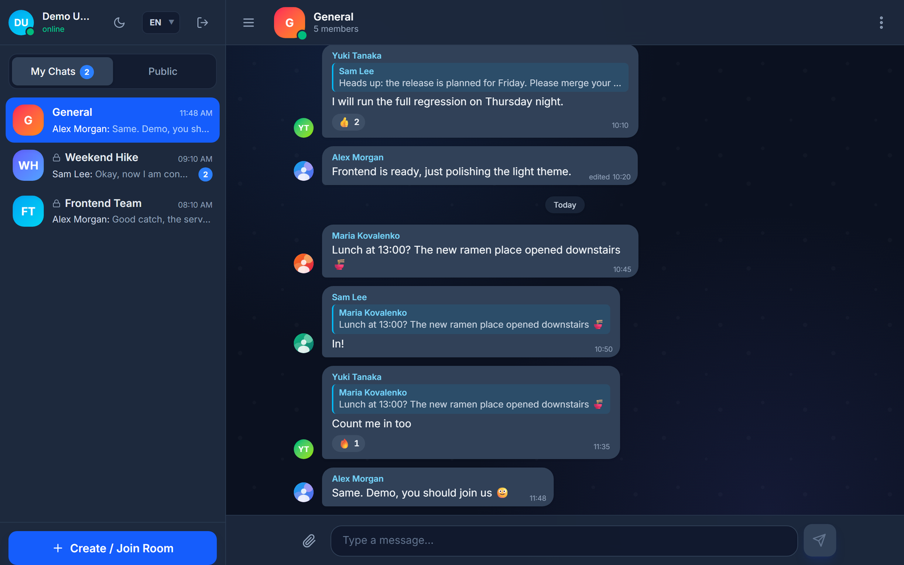
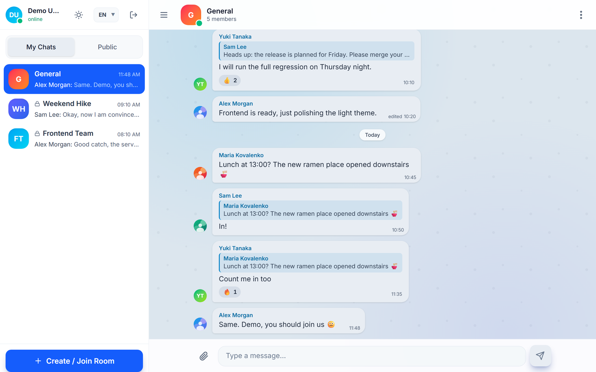
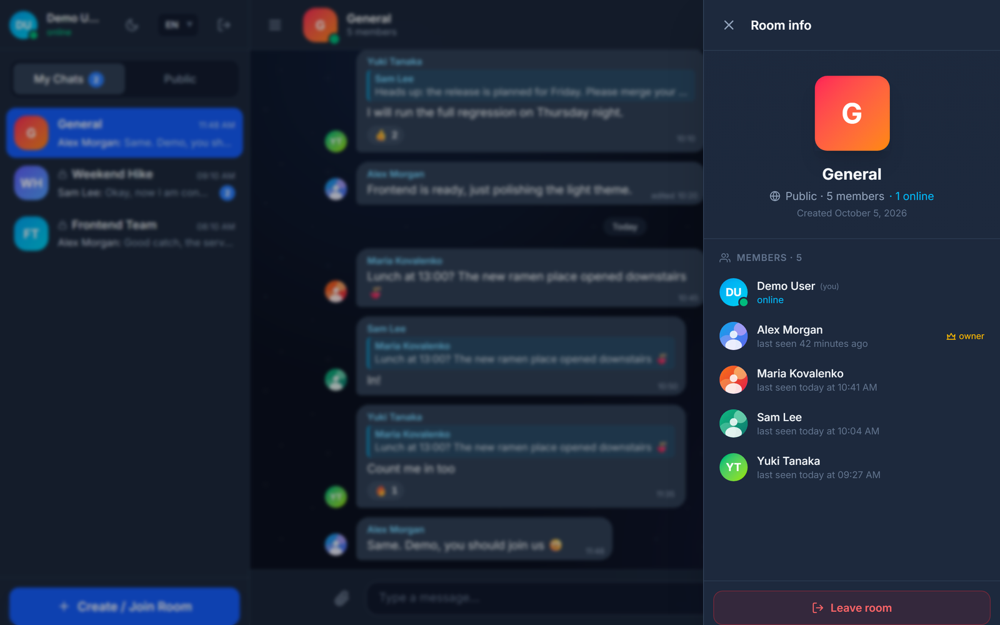
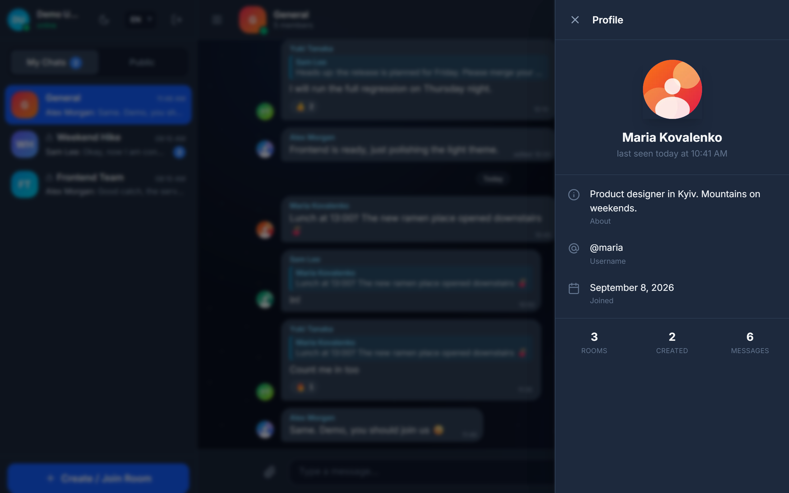
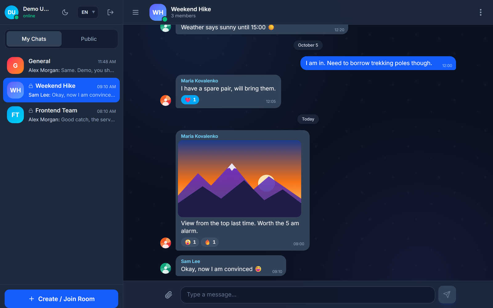
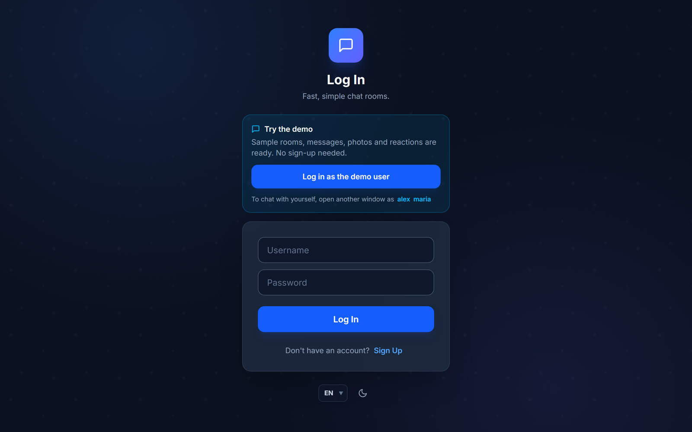
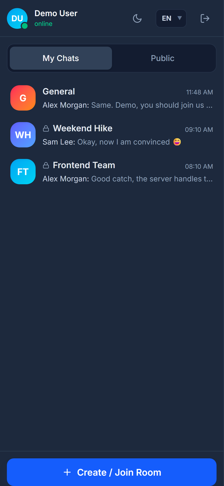
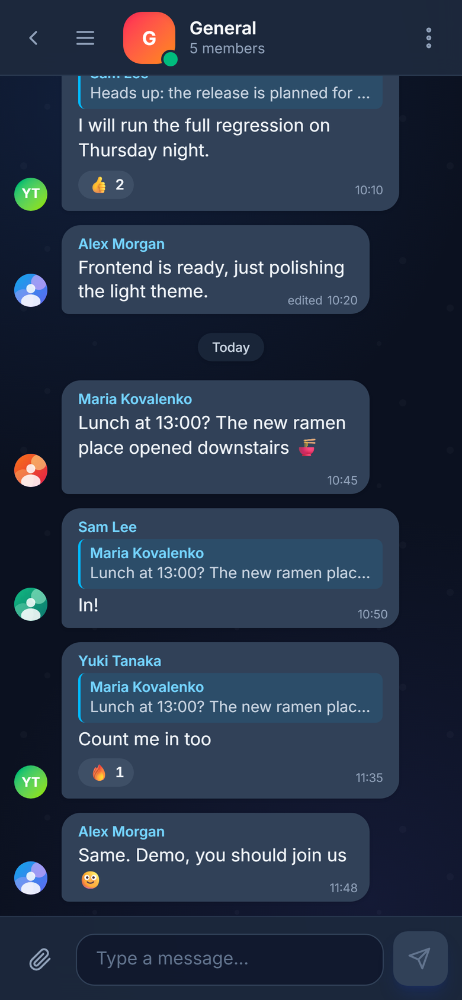
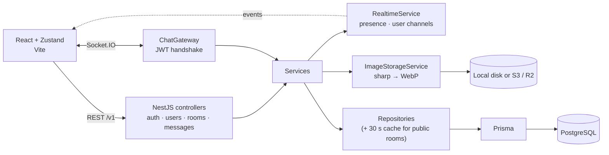

# Real-Time Chat

[](https://github.com/Shiw4se/nest-react-chat/actions/workflows/ci-tests.yml)


A Telegram-style real-time chat: public and private rooms, replies, reactions, photos, online presence and unread counters, built with NestJS, Socket.IO, PostgreSQL and React.

**Live demo:** https://chat-frontend-cvg2.onrender.com — press **Try the demo** (free tier: the first load can take about a minute while the server wakes up).

**Run locally:** `docker compose up --build`, open http://localhost:8080 and press **Try the demo**. The demo opens with sample rooms and conversations already loaded.

<p align="center">
  
</p>

| Dark | Light |
|---|---|
|  |  |
|  |  |
|  |  |

<p align="center">
  
  &nbsp;
  
</p>

## Features

**Messaging**
- Live messages, typing indicator, edits and deletion that every member sees instantly
- Replies with a quoted original you can click to jump to; ↑ edits your last message
- Emoji reactions with live counters
- Photos: pick, paste or drag & drop, add a caption, open full screen
- Message history loads page by page as you scroll up

**Rooms and people**
- Public rooms and private rooms joined by invite link or by username
- Room list sorted by activity with last-message previews, unread badges and a counter in the browser tab
- Online status and "last seen", member lists, owner can delete a room and members see it disappear live
- Profiles with display name, bio, avatar upload and password change

**Product polish**
- Dark, light and system themes with no flash on load
- English, Ukrainian, Polish and Japanese, with correct plural forms
- Works on phones; keyboard accessible dialogs; onboarding tour
- One-click demo login backed by a seed script

## Key decisions

- **One set of business rules.** The Socket.IO gateway and the REST API call the same services, so access checks, sanitising and membership behave the same way on both paths. Image uploads go over HTTP and are then pushed to the room exactly like text messages.
- **Realtime without module cycles.** A global `RealtimeService` lets any module notify users through a personal `user:<id>` channel. That is how unread badges update for rooms that are not open, and how members learn that a room was deleted.
- **Presence that survives several tabs.** Sockets are counted per user, so closing one tab does not mark you offline; "last seen" is stored on the last disconnect.
- **Uploads are re-encoded, never trusted.** Every image is decoded and re-encoded to WebP with sharp, which strips metadata and rejects files that only pretend to be images. Storage is behind an interface with local-disk and S3 drivers, so the same code runs on a laptop and on hosts whose disk is wiped on deploy.
- **Correct ordering under load.** Messages sent in the same millisecond used to come back in random order; an insertion sequence now breaks ties everywhere messages are sorted.
- **Security basics everywhere.** bcrypt, JWT on both REST and WebSocket, whitelist validation including WebSocket payloads, HTML stripped from messages, rate limits that see real client IPs behind proxies, Helmet, CORS limited to the frontend.
- **Tested at three levels.** Unit tests for services, the gateway and React components (about 150 in total), an API e2e suite, and Playwright tests where two real browsers chat with each other. All of them run in CI.

## Architecture



Data model: `User` (display name, bio, avatar, last seen), `Room` (public or private, with an invite token), `RoomMember` (with the last-read time behind unread counters), `Message` (optional reply, edit time and image) and `Reaction`. Deleting a room or a user cascades to memberships, messages and reactions; the backend also removes the image files.

## API

REST routes are prefixed with `/v1`.

| Method | Route | Description |
|---|---|---|
| POST | `/auth/register` | Create an account |
| POST | `/auth/login` | Log in, receive a JWT |
| GET | `/auth/me` | Current user |
| GET | `/users/me` | Own profile with stats |
| PATCH | `/users/me` | Update display name and bio |
| PATCH | `/users/me/password` | Change password (needs the current one) |
| POST | `/users/me/avatar` | Upload an avatar (multipart field `avatar`, JPEG/PNG/WebP/GIF, max 5 MB) |
| DELETE | `/users/me/avatar` | Remove the avatar |
| GET | `/users/:userId` | Another user's public profile |
| POST | `/rooms` | Create a room |
| GET | `/rooms/my` | Rooms the user belongs to |
| GET | `/rooms/public` | Public rooms |
| GET | `/rooms/:roomId` | Room details with member list |
| POST | `/rooms/join/:token` | Join a private room by invite token |
| POST | `/rooms/:roomId/leave` | Leave a room (owners delete instead) |
| DELETE | `/rooms/:roomId` | Delete a room and its messages (owner only) |
| GET | `/rooms/:roomId/invite-token` | Get the room's invite token |
| PATCH | `/rooms/:roomId/invite-token` | Regenerate the invite token |
| POST | `/rooms/:roomId/invite-user` | Invite a user directly |
| GET | `/messages/:roomId` | Paginated message history |
| POST | `/messages/:roomId/attachments` | Send an image (multipart `file`, optional `caption`, `replyToId`) |

WebSocket events:

| Client → server | Server → client |
|---|---|
| `join` | `userJoined` |
| `sendMessage` | `newMessage` |
| `typing` | `userTyping` |
| `deleteMessage` | |

## Tech stack

| Layer | Technology |
|---|---|
| Backend | NestJS 11, Socket.IO, Prisma 7, PostgreSQL, Passport JWT, sharp, AWS SDK (S3/R2), Helmet, Throttler |
| Frontend | React 19, Vite, TypeScript, Zustand, Tailwind CSS, React Router 7, react-i18next |
| Tests | Jest + Supertest (backend), Vitest + React Testing Library (frontend), Playwright (browser) |
| Delivery | GitHub Actions, Docker Compose, nginx, Render + Neon + Cloudflare R2 |

## Run with Docker

```bash
docker compose up --build
```

Open http://localhost:8080 and press **Try the demo**. Postgres, the API and the SPA (behind nginx) start together; demo data is created automatically. Deploying a free public demo (Render + Neon + Cloudflare R2) is described in [docs/DEPLOY.md](docs/DEPLOY.md).

## Running locally

Requirements: Node.js 20+. PostgreSQL is optional: the backend ships a local server that needs no installer or Docker.

**Database**

```bash
cd backend
npm install
npm run db:start          # first run initialises backend/.pgdata, later runs just start the server
```

This uses the PostgreSQL binaries from the `embedded-postgres` dev dependency and listens on `127.0.0.1:5432` with user `postgres`, password `postgres`, database `chat`. `npm run db:stop` stops it, `npm run db:reset` wipes the data. If you prefer your own PostgreSQL (local install or a free Neon instance), skip this step and point `DATABASE_URL` at it instead.

**Backend**

```bash
cd backend
cp .env.example .env      # DATABASE_URL already matches db:start; set a JWT_SECRET
npx prisma migrate deploy
npm run start:dev
```

**Frontend**

```bash
cd frontend
cp .env.example .env      # points at the backend on http://localhost:3000
npm install
npm run dev
```

Fill the database with demo users, rooms and messages (optional, safe to re-run):

```bash
cd backend
npm run db:seed           # accounts: demo, alex, maria, sam, yuki — password Demo1234
```

Open http://localhost:5173. The Vite dev server proxies `/auth` and `/socket.io` to the backend.

Uploaded avatars are cropped to 256×256 WebP and stored in `backend/uploads` (set `UPLOADS_DIR` to change it). They are served at `/uploads/...` by the backend.

## Tests

```bash
cd backend && npm test          # unit tests for services, controllers and the gateway
cd backend && npm run test:e2e  # end-to-end tests
cd frontend && npm test         # chat store and UI components
```

Browser tests (Playwright, two real users chatting):

```bash
cd e2e
npm ci && npx playwright install chromium
npm test        # with the backend and frontend dev servers running
```

## Project structure

```text
backend/src/
  auth/         registration, login, JWT strategy and guards
  users/        profiles, avatars, password change
  rooms/        rooms, membership, invites, unread state, cached repository
  messages/     history, image messages, replies, edits, reactions
  chat/         Socket.IO gateway and event names
  realtime/     presence and per-user event channels
  storage/      image processing and local / S3 storage drivers
  seed/         demo data
  health/       health check for Docker and hosting
frontend/src/
  api/          REST client and services
  websockets/   connection manager, commands, validation chain
  store/        Zustand stores: auth, chat, rooms, presence, UI
  hooks/        socket connection, chat facade, history, theme
  features/     chat, profile, presence and sign-in screens
  components/   UI kit: avatar, bubbles, dialogs, icons
  locales/      en, uk, pl, ja
e2e/            Playwright tests and the screenshot / GIF capture script
docs/           deployment guide, screenshots, demo GIF
.github/workflows/  lint + build + unit + browser tests
```

## Configuration

The essentials are below; `backend/.env.example`, `frontend/.env.example` and [docs/DEPLOY.md](docs/DEPLOY.md) list every option.

| Variable | Where | Description |
|---|---|---|
| `PORT` | backend | HTTP port (3000) |
| `DATABASE_URL` | backend | PostgreSQL connection string |
| `JWT_SECRET` | backend | Secret for signing tokens |
| `FRONTEND_URL` | backend | Allowed CORS origin |
| `STORAGE_DRIVER` | backend | `local` (default) or `s3` for S3 / Cloudflare R2 |
| `TRUST_PROXY` | backend | Number of proxies in front, for correct rate limiting |
| `VITE_API_URL` | frontend | Backend URL; empty means same origin (Docker image) |
| `VITE_WS_URL` | frontend | Socket.IO URL; defaults to `VITE_API_URL` |
| `VITE_DEMO_ACCOUNTS`, `VITE_DEMO_PASSWORD` | frontend | Enable the one-click demo login |

Regenerate the screenshots and GIF after UI changes with `cd e2e && npm run capture` (demo data and both dev servers required).

## Contact

Telegram: [@shiw4se](https://t.me/shiw4se) · Email: [ausenko476@gmail.com](mailto:ausenko476@gmail.com)
