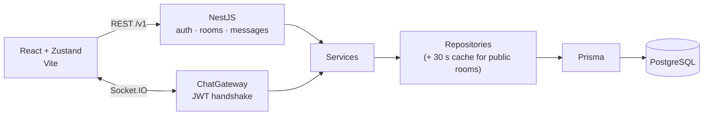

# Real-Time Chat

[](https://github.com/Shiw4se/nest-react-chat/actions/workflows/ci-tests.yml)


A chat application with public and private rooms, live messaging over WebSockets, JWT authentication and persistent history in PostgreSQL.
NestJS on the backend, React with Zustand on the frontend, tests on both sides and a CI pipeline that lints, builds and tests every push.

## Features

**For users**
- Public rooms anyone can join, and private rooms entered through an invite link or a direct invite; owners can regenerate the invite token
- Live messages, typing indicators and join notifications over Socket.IO
- Message history loaded page by page as you scroll up (cursor-based pagination)
- Delete your own messages; everyone in the room sees them disappear
- Registration and login with JWT; the same token protects the REST API and the WebSocket connection
- Four interface languages: English, Ukrainian, Polish and Japanese
- Onboarding tour for first-time users and keyboard-accessible modals

**Under the hood**
- **One set of business rules** — the WebSocket gateway reuses the same services as the REST API, so rooms, membership and messages behave identically whichever way they are reached
- **Repository pattern** — repositories are injected by token; `CachedRoomsRepository` wraps the real one and caches the public room list for 30 seconds without the service knowing
- **Guards** — `JwtAuthGuard` for REST, `RoomAccessGuard` for room membership; socket connections are verified in `ChatGateway.handleConnection`
- **Frontend WebSocket layer** — a single `WebSocketManager` owns the connection; sending and deleting messages are command objects run through `ChatInvoker`, and a validation chain checks a message before it leaves the browser
- **`useChatFacade`** — the one hook components talk to; it combines the stores, the socket subscription and history loading, keeping transport details out of the UI
- **Security** — bcrypt password hashing, server-side sanitising of message text (all HTML stripped), whitelist request validation, rate limiting (stricter on login and registration), Helmet headers, CORS restricted to the frontend origin
- **Tests & CI/CD** — Jest and Supertest on the backend, Vitest and React Testing Library on the frontend; GitHub Actions lints, builds and runs both suites (plus backend e2e) on every push and pull request. A second workflow runs an automated review on each pull request

## Architecture



Data model: `User` (with optional display name, bio and avatar), `Room` (public or private, with an invite token), `RoomMember` and `Message`. Deleting a room or a user cascades to memberships and messages.

## API

REST routes are prefixed with `/v1`.

| Method | Route | Description |
|---|---|---|
| POST | `/auth/register` | Create an account |
| POST | `/auth/login` | Log in, receive a JWT |
| GET | `/auth/me` | Current user |
| GET | `/users/me` | Own profile with stats |
| PATCH | `/users/me` | Update display name and bio |
| PATCH | `/users/me/password` | Change password (needs the current one) |
| POST | `/users/me/avatar` | Upload an avatar (multipart field `avatar`, JPEG/PNG/WebP/GIF, max 5 MB) |
| DELETE | `/users/me/avatar` | Remove the avatar |
| GET | `/users/:userId` | Another user's public profile |
| POST | `/rooms` | Create a room |
| GET | `/rooms/my` | Rooms the user belongs to |
| GET | `/rooms/public` | Public rooms |
| GET | `/rooms/:roomId` | Room details with member list |
| POST | `/rooms/join/:token` | Join a private room by invite token |
| POST | `/rooms/:roomId/leave` | Leave a room (owners delete instead) |
| DELETE | `/rooms/:roomId` | Delete a room and its messages (owner only) |
| GET | `/rooms/:roomId/invite-token` | Get the room's invite token |
| PATCH | `/rooms/:roomId/invite-token` | Regenerate the invite token |
| POST | `/rooms/:roomId/invite-user` | Invite a user directly |
| GET | `/messages/:roomId` | Paginated message history |
| POST | `/messages/:roomId/attachments` | Send an image (multipart `file`, optional `caption`, `replyToId`) |

WebSocket events:

| Client → server | Server → client |
|---|---|
| `join` | `userJoined` |
| `sendMessage` | `newMessage` |
| `typing` | `userTyping` |
| `deleteMessage` | |

## Tech stack

| Layer | Technology |
|---|---|
| Backend | NestJS 11, Socket.IO, Prisma 7, PostgreSQL, Passport JWT, Helmet, Throttler |
| Frontend | React 19, Vite, TypeScript, Zustand, Tailwind CSS, React Router 7, react-i18next |
| Tests | Jest + Supertest (backend), Vitest + React Testing Library (frontend) |
| CI | GitHub Actions |

## Running locally

Requirements: Node.js 20+. PostgreSQL is optional: the backend ships a local server that needs no installer or Docker.

**Database**

```bash
cd backend
npm install
npm run db:start          # first run initialises backend/.pgdata, later runs just start the server
```

This uses the PostgreSQL binaries from the `embedded-postgres` dev dependency and listens on `127.0.0.1:5432` with user `postgres`, password `postgres`, database `chat`. `npm run db:stop` stops it, `npm run db:reset` wipes the data. If you prefer your own PostgreSQL (local install or a free Neon instance), skip this step and point `DATABASE_URL` at it instead.

**Backend**

```bash
cd backend
cp .env.example .env      # DATABASE_URL already matches db:start; set a JWT_SECRET
npx prisma migrate deploy
npm run start:dev
```

**Frontend**

```bash
cd frontend
cp .env.example .env      # points at the backend on http://localhost:3000
npm install
npm run dev
```

Open http://localhost:5173. The Vite dev server proxies `/auth` and `/socket.io` to the backend.

Uploaded avatars are cropped to 256×256 WebP and stored in `backend/uploads` (set `UPLOADS_DIR` to change it). They are served at `/uploads/...` by the backend.

## Tests

```bash
cd backend && npm test          # unit tests for services, controllers and the gateway
cd backend && npm run test:e2e  # end-to-end tests
cd frontend && npm test         # chat store and UI components
```

## Project structure

```text
backend/src/
  auth/         registration, login, JWT strategy and guards
  rooms/        rooms, membership, invites, cached repository
  messages/     message history and sending
  chat/         Socket.IO gateway and event names
  prisma/       Prisma service
frontend/src/
  api/          REST client and services
  websockets/   connection manager, commands, validation chain
  store/        Zustand stores: auth, chat, rooms, UI
  hooks/        useChatFacade, useChatSocket, useChatHistory
  features/     chat screens and components
  locales/      en, uk, pl, ja
.github/workflows/  lint + build + tests, automated PR review
```

## Configuration

| Variable | Where | Description |
|---|---|---|
| `PORT` | backend | HTTP port (3000) |
| `DATABASE_URL` | backend | PostgreSQL connection string |
| `JWT_SECRET` | backend | Secret for signing tokens |
| `FRONTEND_URL` | backend | Allowed CORS origin |
| `VITE_API_URL` | frontend | Backend URL for REST (dev proxy target) |
| `VITE_WS_URL` | frontend | Backend URL for Socket.IO (dev proxy target) |

## Contact

Telegram: [@shiw4se](https://t.me/shiw4se) · Email: [ausenko476@gmail.com](mailto:ausenko476@gmail.com)
